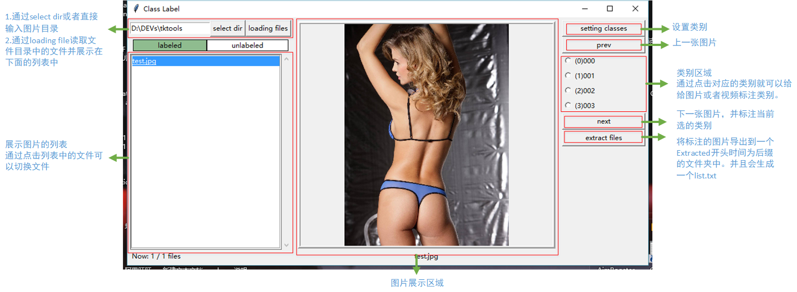
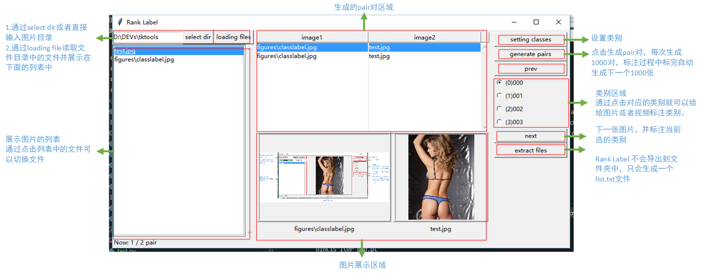

**Here are some useful tools for myself.**

I will share some tools which are coded in python with tkinter. 

---

## ClassLabel

**ClassLabel** is a tool for label files. Now it's could show img and video. 

1. You could use run the tool from the source: `$> python classlabel.py` 
2. You also could pack the tool to **.exe** or **.app** by pyinstaller: `$> pyinstaller -F -w classlabel.py` 
3. If you pack the tool, you **have to** copy the **opencv_ffmpeg???_??.dll** to your pack directory. Because the Pyinstaller can't pack the **opencv_ffmpeg** auto. Usually, The path to opencv_ffmpeg???_??.dll is `\path\to\Anaconda3\Lib\site-packages\cv2`
4. Button `Extract File` would create a root directory and copy files in to corresponding directory. 
root directory is `Extracted_YY_mm_dd_HH_MM_SS`

## RankLabel

**RankLabel** is a tool for label pair for rank. Now it's could show img and video. 

1. You could use run the tool from the source: `$> python ranklabel.py` 
2. You also could pack the tool to **.exe** or **.app** by pyinstaller: `$> pyinstaller -F -w ranklabel.py` 
3. If you pack the tool, you **have to** copy the **opencv_ffmpeg???_??.dll** to your pack directory. Because the Pyinstaller can't pack the **opencv_ffmpeg** auto. Usually, The path to opencv_ffmpeg???_??.dll is `\path\to\Anaconda3\Lib\site-packages\cv2`
4. Button `Extract File` would create a list file and add labeled pairs into the file. 
File's name is `extracted_YY_mm_dd_HH_MM_SS.txt`

